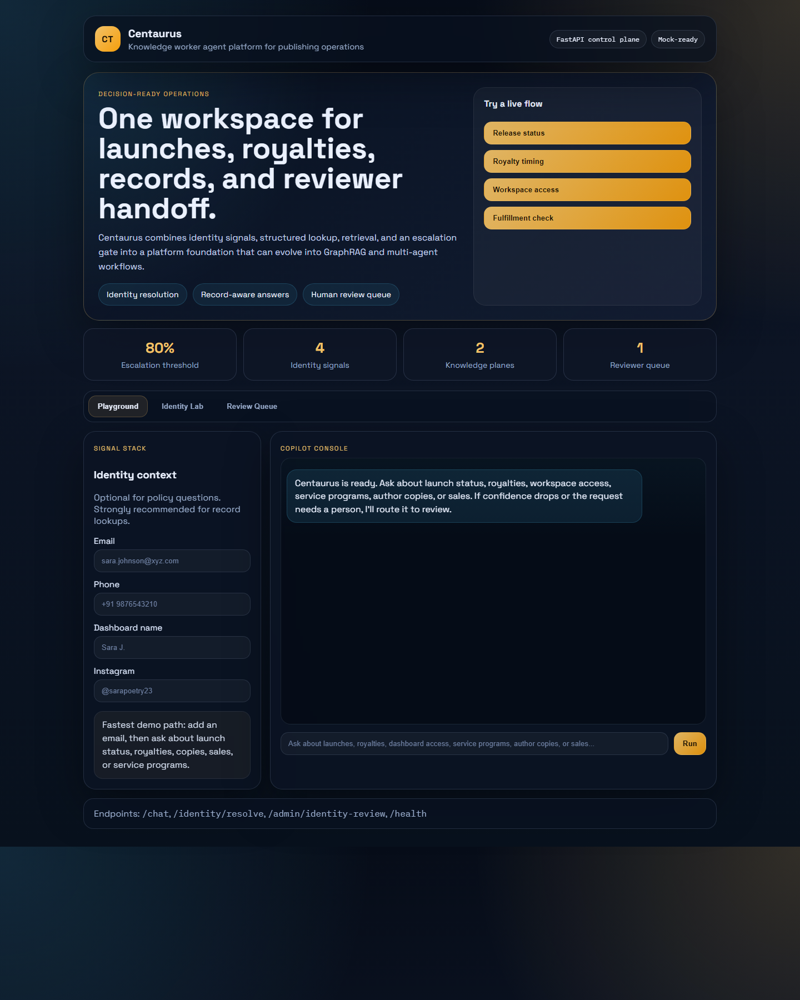

# Centaurus

Centaurus is a knowledge worker agent platform for publishing operations. It combines structured record lookup, retrieval-augmented answers, identity resolution, and human review gates into one FastAPI-based control plane that can grow into a full GraphRAG and multi-agent system.



[](https://fastapi.tiangolo.com/)
[](https://supabase.com/)
[](https://openai.com/)
[](https://www.docker.com/)
[](https://python.org/)

## What Centaurus Does

Centaurus is designed around a narrow but realistic operating domain: publishing workflows. Teams need fast, grounded answers about launch timelines, royalties, fulfillment, dashboard access, and service status. That makes the project a strong sandbox for the exact engineering problems that show up in modern AI platform work:

- Retrieval over policy and process knowledge
- Identity resolution across noisy user signals
- Safe access to structured operational records
- Confidence-based escalation and human review
- A clean upgrade path toward agents, GraphRAG, evals, and observability

## What Ships In This Repo Today

- FastAPI control plane with `/chat`, `/identity/resolve`, `/admin/identity-review`, and `/health`
- Record-aware response flow backed by Supabase or deterministic mock mode
- Lightweight RAG over a Markdown operations manual
- Multi-signal identity resolution across email, phone, dashboard name, and Instagram handle
- Confidence scoring with automatic human escalation below the safety threshold
- Web demo UI served directly from FastAPI
- Streamlit chat console for quick local testing
- Seed SQL, mock data, and REST client test cases for repeatable demos
- Optional workflow ingress example in `n8n_workflows/centaurus_gateway.json`

## Current Product Positioning

Centaurus is intentionally presented as a product foundation, not a one-off chatbot demo. The current codebase is the operational core for a broader knowledge operations platform:

- Today: structured lookup + lightweight retrieval + identity + review queue
- Next: hybrid Qdrant retrieval + reranking
- Then: Neo4j graph context and GraphRAG
- Then: LangGraph supervisor with specialist agents
- Then: evaluation, observability, and cloud deployment

## Why This Direction

This repo focuses on the signals that matter most for AI engineering roles in 2026:

- Real retrieval systems instead of keyword-only demos
- Agent orchestration with explicit state and safe fallbacks
- Evaluation and observability as first-class platform concerns
- Free-tier-friendly infrastructure choices with a clear paid upgrade path

The implementation roadmap for that path is documented in:

- [`docs/STRATEGIC_EVALUATION.md`](docs/STRATEGIC_EVALUATION.md) — plan comparison and honest scope decisions
- [`TECHNICAL_ARCHITECTURE.md`](TECHNICAL_ARCHITECTURE.md)
- [`docs/ROADMAP.md`](docs/ROADMAP.md)
- [`docs/IMPLEMENTATION_HANDOFF.md`](docs/IMPLEMENTATION_HANDOFF.md)

## Free-Tier Build Strategy

The project is scoped so the next major upgrades can stay inside a realistic low-cost stack:

- Local development: FastAPI + mock mode + SQLite-free file artifacts
- Vector retrieval: Qdrant free tier or self-hosted Qdrant in Docker
- Graph layer: Neo4j AuraDB Free or local Neo4j container
- Observability: self-hosted Langfuse OSS when needed
- Evaluation: DeepEval and RAGAS in local or CI workflows
- Deployment preview: Docker locally first, then a lightweight Cloud Run or container-hosted preview

Paid upgrades remain straightforward later:

- Managed vector and graph infrastructure
- Production observability storage
- Better rerankers and commercial model routing
- AWS/GCP infrastructure-as-code rollout

## Repo Guide

```text
backend/
  main.py                    FastAPI app and request pipeline
  services/
    intent_classifier.py     Query understanding
    identity_unifier.py      Multi-signal identity matching
    data_retriever.py        Structured record lookup
    knowledge_base.py        Markdown retrieval layer
    confidence_scorer.py     Safety gate and escalation rules
    response_generator.py    Final answer synthesis
frontend/
  chat_ui.py                 Streamlit console
knowledge_base/
  centaurus_ops_manual.md    Retrieval source document
supabase/
  schema.sql                 Core tables
  seed.sql                   Demo data
web/
  index.html                 Browser UI shell
  styles.css                 Brand and layout
  app.js                     Frontend interactions
docs/
  ROADMAP.md                 Detailed product roadmap
  IMPLEMENTATION_HANDOFF.md  Build sequence and handoff context
```

## Run Locally

```bash
git clone https://github.com/kunal-gh/Centaurus.git
cd Centaurus
pip install -r requirements.txt
uvicorn backend.main:app --reload --host 0.0.0.0 --port 8000
```

Mock mode is enabled automatically when `OPENAI_API_KEY` is missing or set to `test`. You can also force it with `CENTAURUS_MOCK_MODE=1`.

### Optional Streamlit Console

```bash
streamlit run frontend/chat_ui.py
```

## Environment Variables

```env
SUPABASE_URL=
SUPABASE_KEY=
OPENAI_API_KEY=
CENTAURUS_MOCK_MODE=
```

## Endpoints

- `GET /` redirects to the browser UI
- `POST /chat` runs the main answer pipeline
- `POST /identity/resolve` runs identity resolution only
- `GET /admin/identity-review` returns pending reviewer decisions
- `POST /admin/identity-review/{id}/approve` approves a queued decision
- `POST /admin/identity-review/{id}/reject` rejects a queued decision
- `GET /health` returns service and database status

## Testing

- REST scenarios: `tests/test_queries.http`
- Smoke checks: `scripts/debug_smoke.py`

## Near-Term Roadmap

- Wave 1: hybrid Qdrant retrieval, reranking, citations, RAGAS golden-set baseline
- Wave 2: Langfuse / OpenTelemetry tracing across the full request path
- Wave 3: Neo4j graph layer and GraphRAG-lite context assembly
- Wave 4: LangGraph supervisor with identity, publishing, royalty, knowledge, and escalation agents
- Wave 5: reviewer feedback loop and Self-RAG lite (adaptive retrieval grading)
- Wave 6: DeepEval + RAGAS CI with regression gates
- Wave 7: LiteLLM gateway, Presidio PII scrubbing, Docker Compose full stack
- Wave 8: MCP server surface and Cloud Run preview deploy

Full rationale: [`docs/STRATEGIC_EVALUATION.md`](docs/STRATEGIC_EVALUATION.md)

## Screens And Diagrams

- Architecture diagram: `docs/architecture_diagram.png`
- Identity flowchart: `docs/identity_flowchart.png`
- Optional workflow ingress diagram: `docs/n8n_workflow.png`

## License

This repository currently ships without a license file. Add one before broader distribution if you want the code to be reused publicly.
