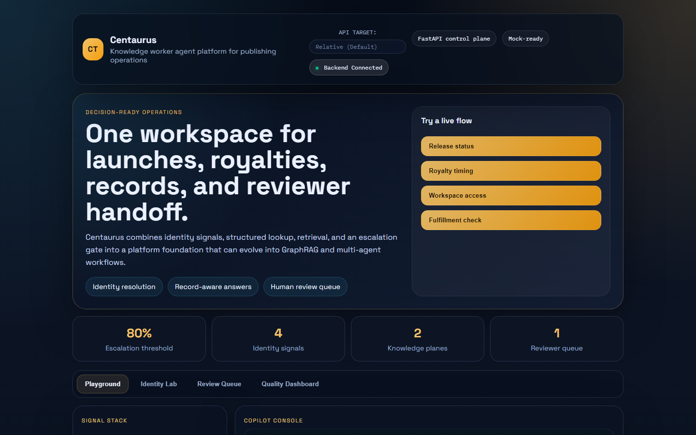
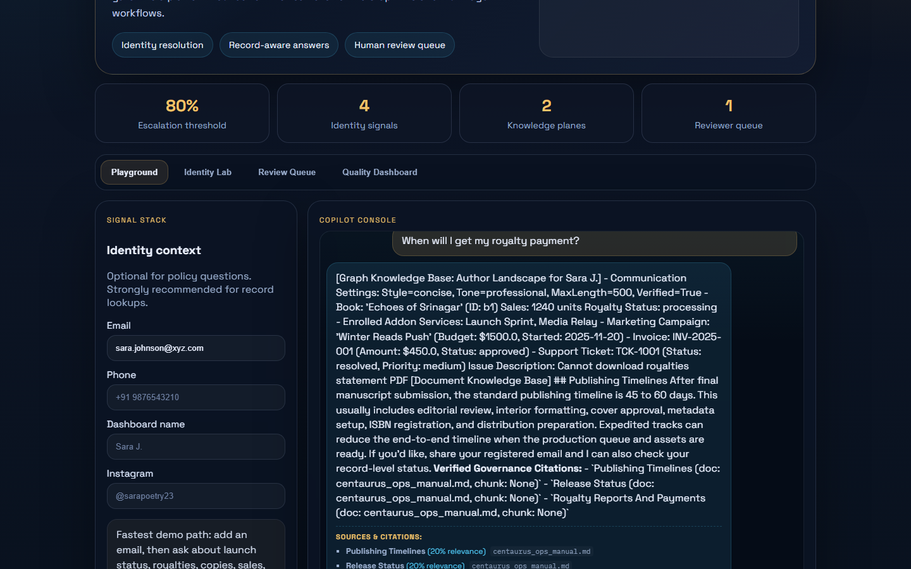
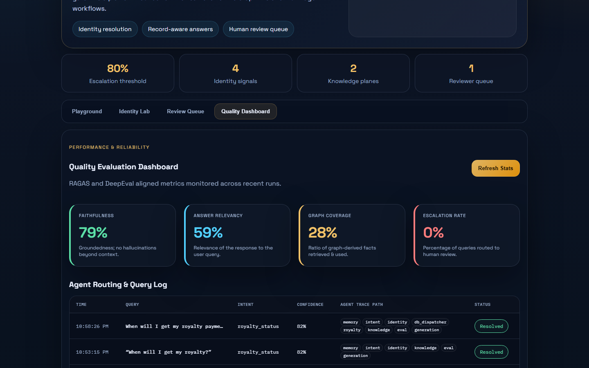
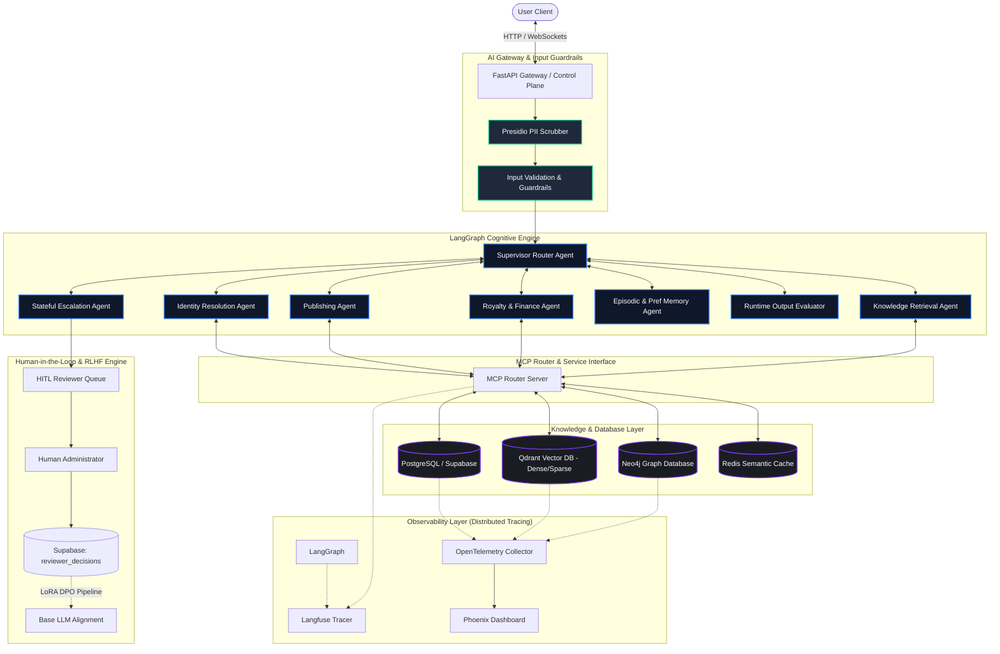

<div align="center">
  <h1>🌌 CENTAURUS</h1>
  <p><b>Enterprise Knowledge Worker Agent Platform & Multi-Agent Cognitive OS</b></p>
  <p>
    <i>Production-grade AI systems engineering demonstrating LangGraph multi-agent orchestration, Neo4j GraphRAG, Qdrant Hybrid Search, Human-in-the-Loop (HITL) Direct Preference Optimization (DPO), and Distributed Observability.</i>
  </p>
</div>

<br/>

> [!IMPORTANT]
> **Centaurus is not a chatbot.** It is a showcase of Enterprise AI architecture designed to demonstrate how to separate **Reasoning**, **Knowledge**, **Execution**, **Governance**, and **Evaluation** in large-scale LLM installations. The publishing operational domain (authors, contracts, royalty schedules) is used as a demonstration surface to highlight enterprise-ready architectural signals.

---

## 🎯 Architectural Positioning & Vision

Centaurus is engineered as a **Knowledge Operating System for Human + AI Collaboration**. It is designed to act as an enterprise-grade knowledge engine (reminiscent of Palantir Foundry or Glean) rather than a simple support bot. 

```
               [ User Input ]
                     │
                     ▼
  ┌──────────────────────────────────────┐
  │      Reasoning (Cognitive OS)        │ ◄─── LangGraph Orchestration
  └──────────────────┬───────────────────┘
                     │
         ┌───────────┴───────────┐
         ▼                       ▼
  ┌─────────────┐         ┌─────────────┐
  │  Knowledge  │         │  Execution  │ ◄─── MCP & Supabase Tooling
  └──────┬──────┘         └─────────────┘
         ├───────────────────────┐
         ▼                       ▼
  ┌─────────────┐         ┌─────────────┐
  │  GraphRAG   │         │ Hybrid RAG  │ ◄─── Neo4j Graph + Qdrant Dense/Sparse
  └─────────────┘         └─────────────┘
```

### The Separation of Concerns
1. **Reasoning (LLMs):** LLMs function exclusively as processing engines to interpret user queries, synthesize context, translate questions into formal query languages (Cypher/SQL), and reason over retrieved data. They are never trusted as source-of-truth stores.
2. **Knowledge (Vector/Graph/Relational):** author details, book statuses, and royalty schedules reside in Postgres (Supabase). Relational chains and dependencies are modeled in Neo4j (GraphRAG). Non-structured operational policies are indexed in Qdrant (Dense/Sparse Vector).
3. **Execution (LangGraph & Tools):** Dynamic workflow routing, task decomposition, and cyclical control loops are orchestrated via LangGraph state machines.
4. **Governance & Safety (HITL Queue):** Low-confidence inferences are caught by an automated safety gate, statefully suspended, and pushed to a human administrator for review and alignment.
5. **Evaluation (LLMOps):** Automated CI/CD validation checks context precision, faithfulness, and answer relevancy against golden datasets before any code or model updates are deployed.
6. **Observability (Telemetry):** Full trace instrumentation tracks every state transition, tool call, database latency, and token cost.

---

## 📸 Platform Interface

Centaurus provides a clean, responsive UI that acts as a unified console for interacting with the multi-agent cognitive engine.


*The main playground interface showing the signal stack for identity context and the copilot console for direct query execution.*


*A live multi-agent execution showing intent classification, identity resolution, execution, and semantic provenance/citations.*


*The administrative dashboard tracking inline evaluation scores (Faithfulness, Relevancy, Coverage, and Escalation Rate) and agent log traces.*

---

## 🏗️ Target System Architecture

The following diagram illustrates the target platform topology, tracing queries from the entry client down to the database layers, wrapped in a comprehensive observability fabric:



---

## ⚡ Technical Hiring Signals & Implemented Differentiators

Centaurus is specifically constructed to highlight deep technical competency in modern production AI. The matrix below outlines how these patterns map to high-value AI Engineering roles:

| Domain | Technical Signal | Centaurus Implementation Details |
| :--- | :--- | :--- |
| **Agentic AI** | State Machine Control Flow | Core engine rewritten in `LangGraph` using an event-driven `AgentState` containing message threads, entities, resolved context, and safety tokens. |
| | Multi-Agent Supervisor Pattern | A central `Supervisor` routes processing state dynamically across specialized agents (`Identity`, `Publishing`, `Royalty`, `Knowledge`, `Escalation`). |
| | Human-in-the-Loop Checkpointing | Uses `MemorySaver` thread checkpointing to freeze execution on low-confidence scoring, allowing humans to correct the context before resumption. |
| **Retrieval Systems** | Dense + Sparse Hybrid Search | Integrates `Qdrant` querying using Dense embeddings (FastEmbed `BAAI/bge-small-en-v1.5`) merged with Sparse embeddings (BM25) for high-precision retrieval. |
| | Reciprocal Rank Fusion (RRF) | Fuses results of semantic vector similarity and keyword searches to optimize document retrieval rankings. |
| | Cross-Encoder Reranking | Feeds retrieved chunks through `cross-encoder/ms-marco-MiniLM-L-6-v2` to rank context blocks, pruning noise and lowering token usage. |
| **Knowledge Graphs** | GraphRAG Integration | Houses entity structures in `Neo4j`. Dynamic LLM-generated Cypher queries perform 2-hop traversals to pull complex multi-hop relational context. |
| | Entity Linking & Syncing | Maintains an active ETL pipeline (`scripts/sync_graph.py`) to mirror PostgreSQL operational schemas into Neo4j nodes and relationships. |
| **RLHF / DPO** | Human Feedback Loop | Escalate failures to a review queue, collect human corrections (`chosen` vs `rejected`), and write preference pairs to Supabase. |
| | Preference Fine-Tuning | Built `scripts/train_dpo.py` using Hugging Face `trl` and `peft` to run offline LoRA Direct Preference Optimization to align model reasoning. |
| **AI Observability** | Distributed Tracing | Uses `Langfuse` to capture latency, token tracking, and span breakdown across LLM nodes, retrievers, and database calls. |
| | Correlation Auditing | Links `trace_id` metadata directly inside Supabase transactional tables, aligning tracing spans to physical DB operations. |
| **Platform Eng.** | Production-Grade APIs | Built on async `FastAPI` with typing, robust middleware, connection pooling, and multi-tier exception handoff handlers. |
| | MCP Interface | Implements the Model Context Protocol (MCP) server allowing developers to call Centaurus tool suites directly from Claude Desktop/Cursor. |

---

## 🧠 Core Subsystem Deep Dive

### 1. LangGraph State Machine & Swarm Orchestration
Rather than using fragile prompt-chaining loops, Centaurus models the reasoning path as a cyclic graph. The state is represented by a central, immutable `AgentState` containing:
- `history_summary`: Turn context summary of previous user interactions.
- `user_preferences`: Stored style preferences (`concise`, `verbose`) and communication tone (`technical`, `helpful`).
- `entities`: Extracted metadata tags (emails, names, phone numbers).
- `db_result`: Relational payloads fetched by database agents (books, campaigns, invoices, tickets).
- `graph_text` / `kb_text`: Formatted subgraph facts and vector manual chunks.
- `quality_eval_scores`: Inline groundedness (faithfulness) and relevancy metrics computed before final reply synthesis.
- `visited_nodes`: Route trace log tracking agent traversals.

The platform coordinates cognitive processing across 10 specialized agent nodes:
- **Memory Agent:** Resolves history summaries and style configurations on startup.
- **Intent Agent:** Classifies intent category and extracts query entities.
- **Identity Agent:** Fuzzy matches signals (email, phone, Instagram, name) to link user profiles.
- **DB Dispatcher:** Evaluates request intent to route tasks to Royalty or Publishing specialists.
- **Royalty Agent:** Queries financial metrics, contracts, and invoicing records.
- **Publishing Agent:** Queries book details, status timelines, and campaigns.
- **Knowledge Agent (GraphRAG):** Traces multi-hop Neo4j paths and searches Qdrant collections.
- **Evaluation Agent (Safety Gate):** Conducts inline quality checks; triggers escalations if confidence scores fall below threshold.
- **Generation Agent:** Restructures response according to style preferences and appends provenance metadata citations.
- **Escalation Agent:** Logs failure details and updates the human review queue.

---

### 2. Multi-Source Retrieval Strategy (Vector + GraphRAG)
To guarantee context grounding and eliminate factual hallucinations, Centaurus leverages a dual-engine retrieval pipeline:

```
                  [ Raw User Query ]
                          │
            ┌─────────────┴─────────────┐
            ▼                           ▼
 ┌─────────────────────┐     ┌─────────────────────┐
 │    Neo4j Graph      │     │    Qdrant Hybrid    │
 ├─────────────────────┤     ├─────────────────────┤
 │ - Entity Extraction │     │ - Dense Vector RAG  │
 │ - Cypher Query Gen  │     │ - BM25 Sparse search│
 │ - 2-Hop Traversal   │     │ - Reciprocal Fusion │
 └──────────┬──────────┘     └──────────┬──────────┘
            │                           │
            └─────────────┬─────────────┘
                          ▼
             ┌────────────────────────┐
             │ Cross-Encoder Rerank   │
             └────────────┬───────────┘
                          ▼
            [ Compressed Context Payload ]
```

1. **Hybrid Vector Search:** Ingests document data via a recursive character chunker. Generates dense vectors while simultaneously building a BM25 sparse index in Qdrant. The two search sweeps are unified using Reciprocal Rank Fusion (RRF).
2. **Cross-Encoder Reranking:** Fused results are evaluated via a lightweight local Cross-Encoder. Only chunks scoring above a relevance limit are passed to the context window, optimizing context packaging.
3. **GraphRAG Traversals:** Converts entity extraction records into targeted Cypher queries. It pulls relational paths across nodes:
   ```cypher
   MATCH (a:Author {email: $email})-[:WROTE]->(b:Book)-[c:HAS_CONTRACT]->(ctr:Contract)
   RETURN a.name, b.title, ctr.royalty_rate, ctr.expiration_date
   ```
   This architecture preserves database context that pure vector lookups miss (e.g. tracking contracts associated with secondary titles written by a single author).

---

### 3. Human-in-the-Loop RLHF & DPO Flywheel
The system incorporates an automated dataset-generation loop for continuous alignment training:

1. **Triggering Escalations:** Queries with low confidence scores (e.g. unverified identities or contradictory manual search fragments) trigger the Escalation Agent. The transaction state is frozen, and an escalation log is created in Supabase.
2. **Human Review Dashboard:** Administrators access pending items via `/admin/escalations`, input correct answers and architectural rationale, and post solutions to `/admin/resolve`.
3. **Preference Logging:** Approved outputs are saved alongside original failed output payloads inside a `reviewer_decisions` table:
   - `prompt`: original prompt + system context.
   - `chosen`: human-corrected response.
   - `rejected`: model-generated response that fell below confidence metrics.
4. **LoRA DPO Pipeline:** The training runner (`scripts/train_dpo.py`) formats these pairs into a preference alignment dataset and fine-tunes a base instruction model (e.g., Qwen/Llama) using Hugging Face's `trl.DPOTrainer` and PEFT LoRA, creating a self-improving operational engine.

```python
# scripts/train_dpo.py snippet
from trl import DPOTrainer
from peft import LoraConfig, get_peft_model

peft_config = LoraConfig(
    r=16,
    lora_alpha=32,
    target_modules=["q_proj", "v_proj", "k_proj", "o_proj"],
    lora_dropout=0.05,
    bias="none",
    task_type="CAUSAL_LM",
)

trainer = DPOTrainer(
    model=model,
    ref_model=None, # Shared weights PEFT optimization
    args=training_args,
    beta=0.1, # DPO temperature scaling
    train_dataset=dataset,
    tokenizer=tokenizer,
    peft_config=peft_config,
)
trainer.train()
```

---

### 4. Enterprise Observability & Telemetry
Every database lookup, graph query, and agent transition generates trace spans:
- **Langfuse Instrumentation:** Captures full run traces. Model steps, prompts, retrieval scores, tool routing, and token costs are tracked chronologically.
- **Trace Key Propagations:** Spans carry a unique `trace_id` linked back to the API request context and transaction logs, creating an audit path from operational queries to the database states.
- **Performance Diagnostics:** Trace analytics expose query bottleneck points, token usage distribution, and routing latency.

---

## 💾 Memory Strategy

Centaurus implements a four-tiered cognitive memory topology:
- **Episodic Memory:** Captures the current transaction's conversational history. Preserved in database threads and propagated through the LangGraph `messages` state.
- **Semantic Memory:** Houses unstructured policies, operations rules, and reference guides. Kept as dense and sparse embeddings inside Qdrant.
- **Preference Memory:** Stores structural styling preferences and human-in-the-loop correction patterns inside Supabase to guide subsequent context generation.
- **Organizational Memory:** Captures the relational enterprise landscape (contracts, publishing tracks, authors, royalties) stored inside Neo4j.

---

## 🔒 Security & Governance Guardrails

To protect enterprise data in production contexts, Centaurus deploys:
1. **PII Redaction:** Intercepts raw user prompts via Microsoft Presidio to locate and redact sensitive identifiers (Social Security Numbers, Credit Card details) before external LLM routing.
2. **Deterministic Confidence Gates:** The safety gate evaluates scores across three vectors:
   - *Classification Confidence* (Intent clarity)
   - *Identity Matching Precision* (Weighted matcher score)
   - *Context Relevance* (Cosine proximity from Vector searches)
3. **Structured Verification:** Responses are parsed through formatting guardrails to verify references and assert that no unsupported statements pass into output payloads.

---

## 🚀 Local Development Setup

Centaurus is designed to run locally using Docker containers for the database and telemetry stacks.

### Prerequisites
- Python 3.10+
- Docker & Docker Compose
- Supabase account (or local Supabase instance)

### 1. Environment Setup
Clone the repository and copy the environment template:
```bash
cp .env.example .env
```
Fill in the `.env` file with your API keys (OpenAI, Supabase url/anon key, and database parameters).
*(Note: To run tests locally without API calls, set `CENTAURUS_MOCK_MODE=true`)*

### 2. Boot Local Infrastructure
Run the Docker Compose files to spin up the local Neo4j database and Langfuse telemetry stack:
```bash
# Spin up Neo4j
docker-compose -f docker/neo4j-compose.yml up -d

# Spin up Langfuse Tracing
docker-compose -f docker/langfuse-compose.yml up -d
```

### 3. Synchronize Knowledge DBs
Hydrate the vector and graph stores. This script queries the Supabase relational schema and performs an idempotent 1-way synchronization to Neo4j nodes and Qdrant collections:
```bash
python scripts/sync_graph.py
```

### 4. Start the Application Control Plane
Launch the FastAPI gateway:
```bash
uvicorn backend.main:app --reload --port 8000
```
Open your browser to `http://localhost:8000/app/` to access the playground UI.

### 5. Start the Model Context Protocol (MCP) Server
Boot the stdio MCP server to expose the 12 operational tool pipelines to external agents/Cursor/Claude Desktop:
```bash
python backend/mcp_server.py
```

### 6. View the Quality Dashboard
In the Playground UI (`http://localhost:8000/app/`), navigate to the **Quality Dashboard** tab to view real-time RAGAS metrics, faithfulness averages, graph coverage stats, and trace path arrays.

---

## 🧪 LLMOps & Continuous Evaluation

Centaurus treats AI testing with the same rigor as traditional software engineering, implementing an automated evaluation pipeline:
- **Golden Test Set:** Located at `tests/evals/golden.json`, featuring 25 distinct reference queries, expected contexts, and canonical outputs.
- **RAGAS & DeepEval Integration:** The evaluation test suite (`tests/evals/run.py`) processes baseline datasets and evaluates quality parameters:
  - **Faithfulness:** Verifies that the answer is grounded strictly in the retrieved context.
  - **Context Precision:** Ensures the most relevant document chunks are ranked highest.
  - **Answer Relevancy:** Measures how well the output addresses the user's prompt.
- **CI/CD Integration Gate:** The testing runner generates regression reports and exits with a non-zero code if any quality metric drops more than 5% compared to the historical baseline, preventing model updates or code regressions from entering production.

Run evaluations locally:
```bash
python -m pytest tests/
python -m tests.evals.run
```

---

<div align="center">
  <i>Centaurus is architected to represent the frontier of production-ready Enterprise Knowledge Worker Platforms. Built by Principal AI Architects for Principal AI Architects.</i>
</div>
