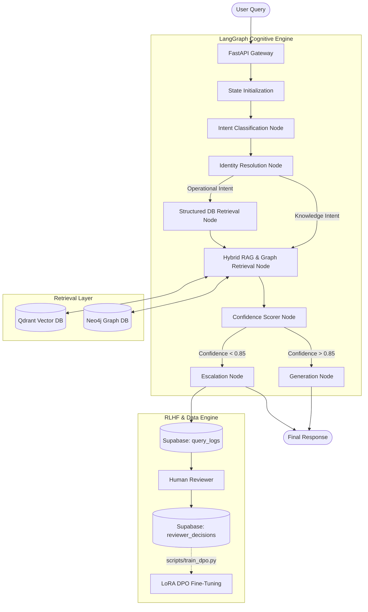

<div align="center">
  <h1>🌌 Centaurus</h1>
  <p><b>Enterprise Knowledge Worker Platform & Multi-Agent Cognitive Architecture</b></p>
  <p>
    <i>Production-grade AI infrastructure combining Hybrid Search, GraphRAG, LangGraph Orchestration, and Direct Preference Optimization (RLHF).</i>
  </p>
</div>

<br/>

## 🎯 Executive Summary
Centaurus is a production-ready **Multi-Agent Cognitive Architecture** designed to autonomously resolve complex, domain-specific queries that traditional naive RAG pipelines fail to handle. 

Built to demonstrate advanced AI engineering paradigms, Centaurus moves beyond standard vector search by integrating **Neo4j Graph traversals (GraphRAG)** for multi-hop relational reasoning, **LangGraph** for non-deterministic state machine orchestration, and **HuggingFace TRL** for continuous model alignment via Direct Preference Optimization (DPO).

It is built specifically to address the core challenges in enterprise GenAI:
1. **Hallucinations over Relational Data:** Solved via GraphRAG (Neo4j) deterministic context injections.
2. **Context Window Saturation:** Solved via Hybrid RRF Retrieval (Dense + Sparse) and Cross-Encoder Reranking.
3. **Unpredictable Execution:** Solved via LangGraph cyclical state machines with Human-in-the-Loop (HITL) checkpoints.
4. **Model Drift & Alignment:** Solved via continuous RLHF/DPO training on human reviewer escalations.

---

## 🧠 Core Technical Pillars

### 1. Multi-Agent Orchestration (LangGraph)
Linear prompt chaining is insufficient for complex enterprise tasks. Centaurus utilizes a cyclical, state-driven multi-agent architecture built on `LangGraph`.
- **Global State Management:** Immutable `AgentState` propagation across specialized nodes (Intent, Identity, Knowledge, Escalation).
- **Supervisor Routing:** Dynamic control flow evaluating confidence scores to route between databases or trigger escalations.
- **Human-in-the-Loop (HITL):** Thread checkpointing (`MemorySaver` / `PostgresSaver`) allows execution to pause, await human review for low-confidence inferences, and resume statefully.

### 2. Multi-Modal Retrieval Strategy (Hybrid RAG + GraphRAG)
To guarantee high-precision context, Centaurus queries and merges three distinct data topologies at runtime:
- **GraphRAG (Neo4j):** Executes dynamic Cypher queries to traverse multi-hop graphs. Ideal for answering relational questions (e.g., *"Did the author of X book receive royalties for Y add-on service?"*).
- **Hybrid Vector RAG (Qdrant):** Fuses Dense embeddings (384-dimensional semantic search) with Sparse vectors (BM25 keyword search) using Reciprocal Rank Fusion (RRF).
- **Cross-Encoder Reranking:** Passes the fused corpus through an MS-MARCO Cross-Encoder to penalize contextually irrelevant chunks before LLM ingestion.

### 3. Telemetry & AI Observability
You can't optimize what you can't measure. The entire pipeline is heavily instrumented:
- **Distributed Tracing (Langfuse):** End-to-end span generation for every LLM call, DB query, and graph traversal, capturing granular latency, token usage, and cost.
- **Trace Correlation:** Generates unique `trace_id` signatures propagated to the Supabase operational logs, creating a 1:1 mapping between User Sessions, DB States, and LLM Inference graphs.

### 4. Continuous Alignment (RLHF via DPO)
Centaurus features a self-improving data flywheel. 
- **Escalation Routing:** When the confidence scorer rejects a generation, it is routed to a human reviewer via the `/admin/escalations` API.
- **Preference Dataset Generation:** Reviewers submit the correct response, automatically generating `(prompt, chosen, rejected)` tuple pairs in the `reviewer_decisions` table.
- **Direct Preference Optimization (DPO):** Uses a built-in HuggingFace `trl` pipeline (`scripts/train_dpo.py`) to fine-tune the LLM via LoRA (Low-Rank Adaptation) without needing a separate reward model.

---

## 🏗️ System Architecture



---

## 🛠️ The Tech Stack

| Domain | Technologies | Purpose |
|--------|-------------|---------|
| **Orchestration** | `LangGraph`, `LangChain`, `FastAPI` | Cyclical multi-agent state management & async serving. |
| **Vector DB** | `Qdrant`, `FastEmbed` | Dense+Sparse hybrid vector retrieval. |
| **Graph DB** | `Neo4j`, `Cypher` | Relational 2-hop GraphRAG traversals. |
| **Data & Auth** | `Supabase` (PostgreSQL) | Identity mapping, operational data, and preference logging. |
| **Observability** | `Langfuse`, `OpenTelemetry` | Granular span tracing, latency monitoring, and token tracking. |
| **Alignment Ops** | `TRL`, `PEFT` (LoRA), `PyTorch` | RLHF DPO training pipeline. |

---

## 🚀 Local Development Setup

Centaurus is engineered to be portable. The core infrastructure can be spun up entirely locally via Docker.

### 1. Environment Configuration
Clone the repository and configure the environment:
```bash
cp .env.example .env
```
Populate `.env` with your Supabase keys, OpenAI keys, and Qdrant/Langfuse preferences. (Set `CENTAURUS_MOCK_MODE=1` to run deterministic tests without API keys).

### 2. Boot Infrastructure
Spin up the local Graph Database and Telemetry server:
```bash
# Start local Neo4j Graph DB
docker-compose -f docker/neo4j-compose.yml up -d

# Start local Langfuse Observability stack
docker-compose -f docker/langfuse-compose.yml up -d
```

### 3. Sync Graph & Vectors
Run the deterministic synchronization scripts to populate Qdrant and Neo4j with Supabase operational data:
```bash
python scripts/sync_graph.py
```

### 4. Run the API
```bash
uvicorn backend.main:app --reload --port 8000
```
API Documentation available at: `http://localhost:8000/docs`

---

## 🧪 Evaluation & Testing

Centaurus implements rigorous CI/CD principles for GenAI applications:
- **Golden Datasets:** Baseline evaluations are performed against `tests/evals/golden.json`.
- **RAGAS Metrics:** Regression tests are run on every major PR measuring **Faithfulness**, **Answer Relevancy**, and **Context Precision**.

---

<div align="center">
  <i>Built for the future of Autonomous Enterprise Agents.</i>
</div>
